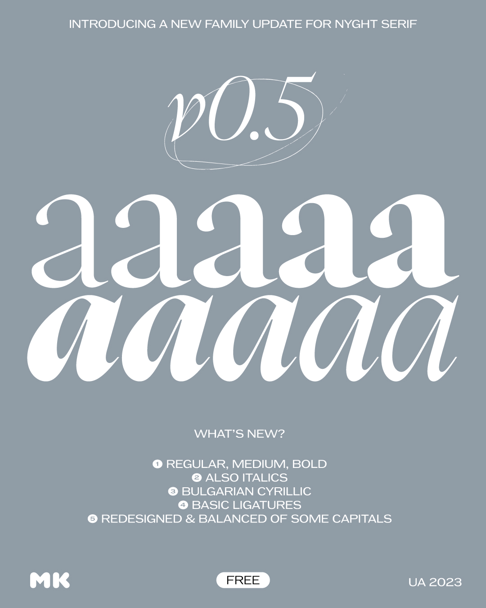
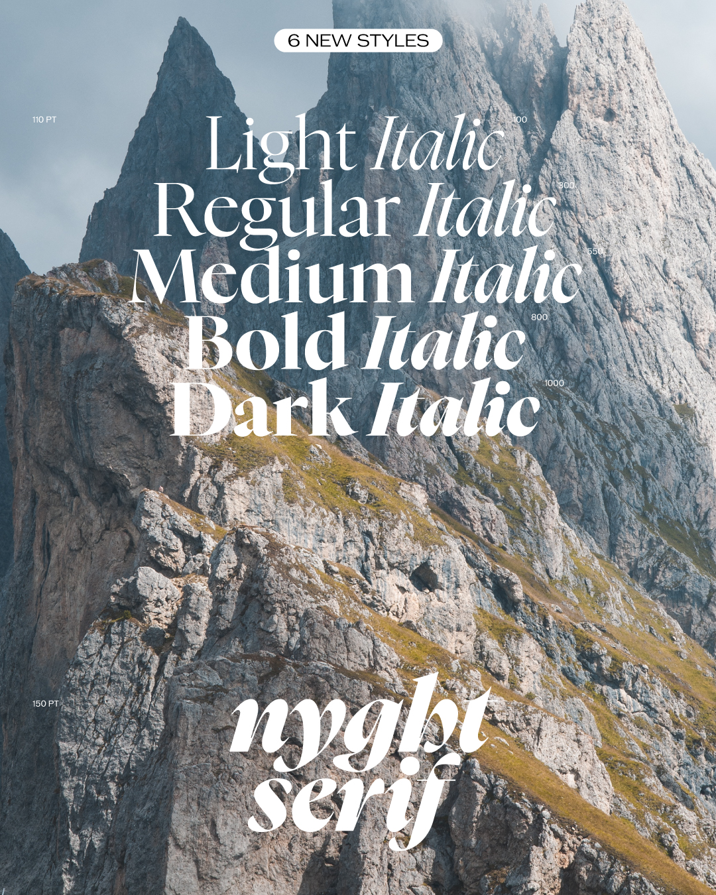
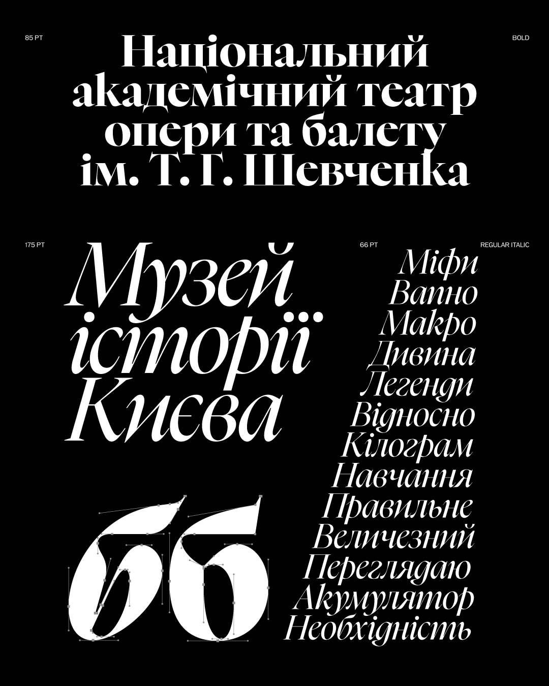

# NYGHT SERIF v0.5

NYGHT SERIF (version 0.5) is a contemporary serif designed by Maksym Kobuzan (www.behance.net/mkobuzan).

## Description

NYGHT SERIF is a contemporary serif with a spicy character. Its contrasting forms combine smooth curves and sharp as a blade serifs and spurs. NYGHT SERIF also knows Extended Latin. It also knows Cyrillic. But only the Ukrainian alphabet. NYGHT SERIF is absolutely FREE for personal and commercial use. It also has an Open Font License (OFL). NYGHT SERIF will be published in progress. And there will be many updates.

## Current Version

FAMILY UPDATE 0.5

1. 6 new styles. Namely Regular, Medium, Bold. And also Italics, of course. Now it's a full-fledged Type Family! 💚
2. Added support for Bulgarian language. Namely, the letters of the Bulgarian Cyrillic alphabet!
3. Added some basic ligatures like ff tt ft.
4. Balanced the width of some Сapital Letters in Light weight. Some letters have become wider, for example P R B. And some letters have become, on the contrary, a little narrower.
5. And as usual, multiple minor changes in the curves. The curves are smoother and more uniform. Some bugs have also been fixed. 🤌

So you need to update all styles as well. And thanks for downloading and enjoying!

## Visuals

## License

This Font Software is licensed under the SIL Open Font License, Version 1.1.
This license is available [here](http://www.tunera.xyz/licenses/sil-open-font-license-1.1/)

## Repository Layout

This font repository structure is inspired by [Unified Font Repository v0.3](https://github.com/unified-font-repository/Unified-Font-Repository).
